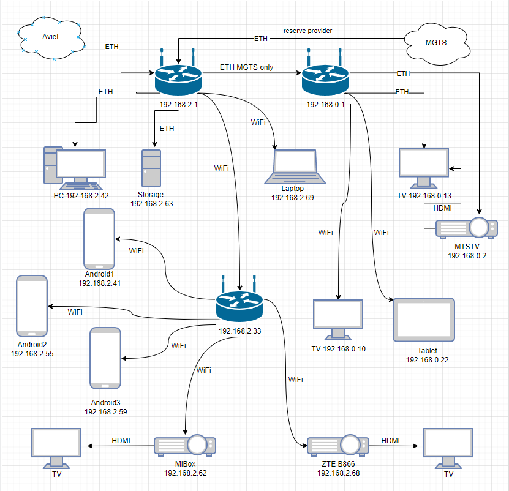

# devops-netology

### «3.8. Компьютерные сети, лекция 3»

1. Подключитесь к публичному маршрутизатору в интернет. Найдите маршрут к вашему публичному IP
---
```shell
root@ubuntu-focal:/home/vagrant# telnet route-views.routeviews.org
Trying 128.223.51.103...
Connected to route-views.routeviews.org.
Escape character is '^]'.
C
**********************************************************************

                    RouteViews BGP Route Viewer
                    route-views.routeviews.org

 route views data is archived on http://archive.routeviews.org

 This hardware is part of a grant by the NSF.
 Please contact help@routeviews.org if you have questions, or
 if you wish to contribute your view.

 This router has views of full routing tables from several ASes.
 The list of peers is located at http://www.routeviews.org/peers
 in route-views.oregon-ix.net.txt

 NOTE: The hardware was upgraded in August 2014.  If you are seeing
 the error message, "no default Kerberos realm", you may want to
 in Mac OS X add "default unset autologin" to your ~/.telnetrc

 To login, use the username "rviews".

 **********************************************************************


User Access Verification

Username: rviews
route-views>
route-views>
route-views>show ip route 93.185.192.92
Routing entry for 93.185.192.0/20
  Known via "bgp 6447", distance 20, metric 0
  Tag 6939, type external
  Last update from 64.71.137.241 2w5d ago
  Routing Descriptor Blocks:
  * 64.71.137.241, from 64.71.137.241, 2w5d ago
      Route metric is 0, traffic share count is 1
      AS Hops 2
      Route tag 6939
      MPLS label: none
route-views>show bgp 93.185.192.92
BGP routing table entry for 93.185.192.0/20, version 1838928186
Paths: (23 available, best #22, table default)
  Not advertised to any peer
  Refresh Epoch 1
  57866 9002 35271, (aggregated by 35271 93.185.207.255)
    37.139.139.17 from 37.139.139.17 (37.139.139.17)
      Origin IGP, metric 0, localpref 100, valid, external
      Community: 9002:0 9002:64667
      path 7FE14684FBF0 RPKI State not found
      rx pathid: 0, tx pathid: 0
  Refresh Epoch 1
  53767 174 20764 21453 35271 35271 35271 35271 35271, (aggregated by 35271 93.185.207.255)
    162.251.163.2 from 162.251.163.2 (162.251.162.3)
      Origin IGP, localpref 100, valid, external
      Community: 174:21101 174:22014 53767:5000
      path 7FE184870C38 RPKI State not found
      rx pathid: 0, tx pathid: 0
  Refresh Epoch 1
  3333 42861 35271, (aggregated by 35271 93.185.207.255)
    193.0.0.56 from 193.0.0.56 (193.0.0.56)
      Origin IGP, localpref 100, valid, external
      Community: 42861:42861
      path 7FE042394620 RPKI State not found
      rx pathid: 0, tx pathid: 0
  Refresh Epoch 1
  1351 20764 20764 20764 20764 20764 20764 20764 21453 35271 35271 35271 35271 35271, (aggregated by 35271 93.185.207.255)
    132.198.255.253 from 132.198.255.253 (132.198.255.253)
      Origin IGP, localpref 100, valid, external
      path 7FE11F4047A0 RPKI State not found
      rx pathid: 0, tx pathid: 0
  Refresh Epoch 1
  20912 3257 28917 35271 35271, (aggregated by 35271 93.185.207.255)
    212.66.96.126 from 212.66.96.126 (212.66.96.126)
      Origin IGP, localpref 100, valid, external
      Community: 3257:4000 3257:8133 3257:50001 3257:50110 3257:54901 20912:65004
      path 7FE08A6E7EC8 RPKI State not found
      rx pathid: 0, tx pathid: 0
  Refresh Epoch 3
  3303 6939 35271, (aggregated by 35271 93.185.207.255)
    217.192.89.50 from 217.192.89.50 (138.187.128.158)
      Origin IGP, localpref 100, valid, external
      Community: 3303:1006 3303:1021 3303:1030 3303:3067 6939:7154 6939:8233 6939:9002
      path 7FE150F04F18 RPKI State not found
      rx pathid: 0, tx pathid: 0
  Refresh Epoch 2
  8283 42861 35271, (aggregated by 35271 93.185.207.255)
    94.142.247.3 from 94.142.247.3 (94.142.247.3)
      Origin IGP, metric 0, localpref 100, valid, external
      Community: 8283:1 8283:101 42861:42861
      unknown transitive attribute: flag 0xE0 type 0x20 length 0x18
        value 0000 205B 0000 0000 0000 0001 0000 205B
              0000 0005 0000 0001
      path 7FE05409AA88 RPKI State not found
      rx pathid: 0, tx pathid: 0
  Refresh Epoch 1
  3549 3356 9002 35271, (aggregated by 35271 93.185.207.255)
    208.51.134.254 from 208.51.134.254 (67.16.168.191)
      Origin IGP, metric 0, localpref 100, valid, external
      Community: 3356:2 3356:22 3356:100 3356:123 3356:503 3356:903 3356:2067 3549:2581 3549:30840
      path 7FE09AC589D8 RPKI State not found
      rx pathid: 0, tx pathid: 0
  Refresh Epoch 1
  3356 9002 35271, (aggregated by 35271 93.185.207.255)
    4.68.4.46 from 4.68.4.46 (4.69.184.201)
      Origin IGP, metric 0, localpref 100, valid, external
      Community: 3356:2 3356:22 3356:100 3356:123 3356:503 3356:903 3356:2067
      path 7FE1662F50D8 RPKI State not found
      rx pathid: 0, tx pathid: 0
  Refresh Epoch 1
  20130 6939 35271, (aggregated by 35271 93.185.207.255)
    140.192.8.16 from 140.192.8.16 (140.192.8.16)
      Origin IGP, localpref 100, valid, external
      path 7FE0B8937FD0 RPKI State not found
      rx pathid: 0, tx pathid: 0
  Refresh Epoch 1
  101 3491 20485 20485 42861 35271, (aggregated by 35271 93.185.207.255)
    209.124.176.223 from 209.124.176.223 (209.124.176.223)
      Origin IGP, localpref 100, valid, external
      Community: 101:20300 101:22100 3491:300 3491:311 3491:9001 3491:9080 3491:9081 3491:9087 3491:62210 3491:62220 20485:10099 20485:52060
      path 7FE0383E46A8 RPKI State not found
      rx pathid: 0, tx pathid: 0
  Refresh Epoch 1
  852 3491 20485 20485 42861 35271, (aggregated by 35271 93.185.207.255)
    154.11.12.212 from 154.11.12.212 (96.1.209.43)
      Origin IGP, metric 0, localpref 100, valid, external
      path 7FE048894680 RPKI State not found
      rx pathid: 0, tx pathid: 0
  Refresh Epoch 1
  2497 3356 9002 35271, (aggregated by 35271 93.185.207.255)
    202.232.0.2 from 202.232.0.2 (58.138.96.254)
      Origin IGP, localpref 100, valid, external
      path 7FE1141223B8 RPKI State not found
      rx pathid: 0, tx pathid: 0
  Refresh Epoch 1
  7660 2516 41095 35271 35271, (aggregated by 35271 93.185.207.255)
    203.181.248.168 from 203.181.248.168 (203.181.248.168)
      Origin IGP, localpref 100, valid, external
      Community: 2516:1030 7660:9003
      path 7FE0E0E65430 RPKI State not found
      rx pathid: 0, tx pathid: 0
  Refresh Epoch 1
  7018 1299 35271 35271, (aggregated by 35271 93.185.207.255)
    12.0.1.63 from 12.0.1.63 (12.0.1.63)
      Origin IGP, localpref 100, valid, external
      Community: 7018:5000 7018:37232
      path 7FE0B3AAAEB8 RPKI State not found
      rx pathid: 0, tx pathid: 0
  Refresh Epoch 1
  49788 1299 35271 35271, (aggregated by 35271 93.185.207.255)
    91.218.184.60 from 91.218.184.60 (91.218.184.60)
      Origin IGP, localpref 100, valid, external
      Community: 1299:30000
      Extended Community: 0x43:100:1
      path 7FE135B321E0 RPKI State not found
      rx pathid: 0, tx pathid: 0
  Refresh Epoch 1
  1221 4637 9002 35271, (aggregated by 35271 93.185.207.255)
    203.62.252.83 from 203.62.252.83 (203.62.252.83)
      Origin IGP, localpref 100, valid, external
      path 7FE1594E7900 RPKI State not found
      rx pathid: 0, tx pathid: 0
  Refresh Epoch 1
  701 5511 3216 29076 35271 35271, (aggregated by 35271 93.185.207.255)
    137.39.3.55 from 137.39.3.55 (137.39.3.55)
      Origin IGP, localpref 100, valid, external
      path 7FE10DA837E8 RPKI State not found
      rx pathid: 0, tx pathid: 0
  Refresh Epoch 1
  3257 28917 35271 35271, (aggregated by 35271 93.185.207.255)
    89.149.178.10 from 89.149.178.10 (213.200.83.26)
      Origin IGP, metric 10, localpref 100, valid, external
      Community: 3257:4000 3257:8133 3257:50001 3257:50110 3257:54901
      path 7FE0FBCF9230 RPKI State not found
      rx pathid: 0, tx pathid: 0
  Refresh Epoch 1
  3561 3910 3356 9002 35271, (aggregated by 35271 93.185.207.255)
    206.24.210.80 from 206.24.210.80 (206.24.210.80)
      Origin IGP, localpref 100, valid, external
      path 7FE112DFE250 RPKI State not found
      rx pathid: 0, tx pathid: 0
  Refresh Epoch 1
  4901 6079 9002 35271, (aggregated by 35271 93.185.207.255)
    162.250.137.254 from 162.250.137.254 (162.250.137.254)
      Origin IGP, localpref 100, valid, external
      Community: 65000:10100 65000:10300 65000:10400
      path 7FE167390740 RPKI State not found
      rx pathid: 0, tx pathid: 0
  Refresh Epoch 1
  6939 35271, (aggregated by 35271 93.185.207.255)
    64.71.137.241 from 64.71.137.241 (216.218.252.164)
      Origin IGP, localpref 100, valid, external, best
      unknown transitive attribute: flag 0xE0 type 0x20 length 0xC
        value 0000 21B7 0000 0777 0000 21B7
      path 7FE0C298D220 RPKI State not found
      rx pathid: 0, tx pathid: 0x0
  Refresh Epoch 1
  19214 3257 28917 35271 35271, (aggregated by 35271 93.185.207.255)
    208.74.64.40 from 208.74.64.40 (208.74.64.40)
      Origin IGP, localpref 100, valid, external
      Community: 3257:4000 3257:8133 3257:50001 3257:50110 3257:54901
      path 7FE0B8FB4AE0 RPKI State not found
      rx pathid: 0, tx pathid: 0
route-views>
```
---
---
2. Создайте dummy0 интерфейс в Ubuntu. Добавьте несколько статических маршрутов. Проверьте таблицу маршрутизации.
---
Изначально маршрутная таблица была такой:
```shell
root@ubuntu-focal:/home/vagrant# ip r
default via 10.0.2.2 dev enp0s3 proto static
default via 10.0.2.2 dev enp0s3 proto dhcp src 10.0.2.15 metric 100
10.0.2.0/24 dev enp0s3 proto kernel scope link src 10.0.2.15
10.0.2.2 dev enp0s3 proto dhcp scope link src 10.0.2.15 metric 100
```
Создаем интерфейс:
```shell
root@ubuntu-focal:/home/vagrant# echo "dummy" > /etc/modules-load.d/dummy.conf
root@ubuntu-focal:/home/vagrant# echo "options dummy numdummies=2" > /etc/modprobe.d/dummy.conf
root@ubuntu-focal:/home/vagrant# systemctl restart systemd-networkd
root@ubuntu-focal:/home/vagrant# lsmod | grep dummy
dummy                  16384  0
```
Прописываем маршрут в netplan:
```shell
root@ubuntu-focal:/home/vagrant# vi /etc/netplan/50-cloud-init.yaml
root@ubuntu-focal:/home/vagrant# cat /etc/netplan/50-cloud-init.yaml
# This file is generated from information provided by the datasource.  Changes
# to it will not persist across an instance reboot.  To disable cloud-init's
# network configuration capabilities, write a file
# /etc/cloud/cloud.cfg.d/99-disable-network-config.cfg with the following:
# network: {config: disabled}
network:
    ethernets:
        enp0s3:
            addresses:
            - 10.0.2.15/24
            gateway4: 10.0.2.2
            nameservers:
              addresses:
              - 8.8.8.8
            dhcp4: true
            match:
                macaddress: 02:78:6c:8f:22:ad
            set-name: enp0s3
            routes:
            - to: 10.0.8.0/24
              via: 10.0.2.2
    version: 2
root@ubuntu-focal:/home/vagrant#
root@ubuntu-focal:/home/vagrant# netplan try
Warning: Stopping systemd-networkd.service, but it can still be activated by:
  systemd-networkd.socket
Do you want to keep these settings?


Press ENTER before the timeout to accept the new configuration


Changes will revert in 115 seconds
Configuration accepted.
root@ubuntu-focal:/home/vagrant# netstat -n -r
Kernel IP routing table
Destination     Gateway         Genmask         Flags   MSS Window  irtt Iface
0.0.0.0         10.0.2.2        0.0.0.0         UG        0 0          0 enp0s3
0.0.0.0         10.0.2.2        0.0.0.0         UG        0 0          0 enp0s3
10.0.2.0        0.0.0.0         255.255.255.0   U         0 0          0 enp0s3
10.0.2.2        0.0.0.0         255.255.255.255 UH        0 0          0 enp0s3
10.0.5.0        0.0.0.0         255.255.255.0   U         0 0          0 dummy0
10.0.8.0        10.0.2.2        255.255.255.0   UG        0 0          0 enp0s3
root@ubuntu-focal:/home/vagrant#
root@ubuntu-focal:/home/vagrant#
root@ubuntu-focal:/home/vagrant# ip -br r
default via 10.0.2.2 dev enp0s3 proto static
default via 10.0.2.2 dev enp0s3 proto dhcp src 10.0.2.15 metric 100
10.0.2.0/24 dev enp0s3 proto kernel scope link src 10.0.2.15
10.0.2.2 dev enp0s3 proto dhcp scope link src 10.0.2.15 metric 100
10.0.5.0/24 dev dummy0 proto kernel scope link src 10.0.5.1
10.0.8.0/24 via 10.0.2.2 dev enp0s3 proto static
root@ubuntu-focal:/home/vagrant#
```

---
---

3. Проверьте открытые TCP порты в Ubuntu, какие протоколы и приложения используют эти порты? Приведите несколько примеров.
---
```shell
root@ubuntu-focal:/home/vagrant# netstat -ntlp | grep LISTEN
tcp        0      0 127.0.0.1:6011          0.0.0.0:*               LISTEN      26944/sshd: vagrant
tcp        0      0 127.0.0.53:53           0.0.0.0:*               LISTEN      597/systemd-resolve
tcp        0      0 0.0.0.0:22              0.0.0.0:*               LISTEN      693/sshd: /usr/sbin
tcp6       0      0 ::1:6011                :::*                    LISTEN      26944/sshd: vagrant
tcp6       0      0 :::22                   :::*                    LISTEN      693/sshd: /usr/sbin
root@ubuntu-focal:/home/vagrant#
```
В данном случае используются протоколы DNS (порт 53) и SSH (порты 22 и 6011)

---
---

4. Проверьте используемые UDP сокеты в Ubuntu, какие протоколы и приложения используют эти порты?
---
```shell
root@ubuntu-focal:/home/vagrant# netstat -nulp
Active Internet connections (only servers)
Proto Recv-Q Send-Q Local Address           Foreign Address         State       PID/Program name
udp        0      0 127.0.0.53:53           0.0.0.0:*                           597/systemd-resolve
udp        0      0 10.0.2.15:68            0.0.0.0:*                           50994/systemd-netwo
root@ubuntu-focal:/home/vagrant#
```
53 порт DNS
68 порт прослушивает DHCP

---
---
5. Используя diagrams.net, создайте L3 диаграмму вашей домашней сети или любой другой сети, с которой вы работали.
---


P.S.: Сдаю хвосты, поэтому, чтобы успеть до закрытия модуля, необязательные сделаю позже.