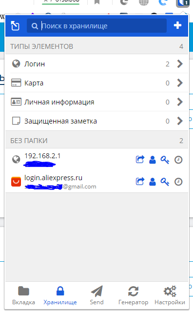
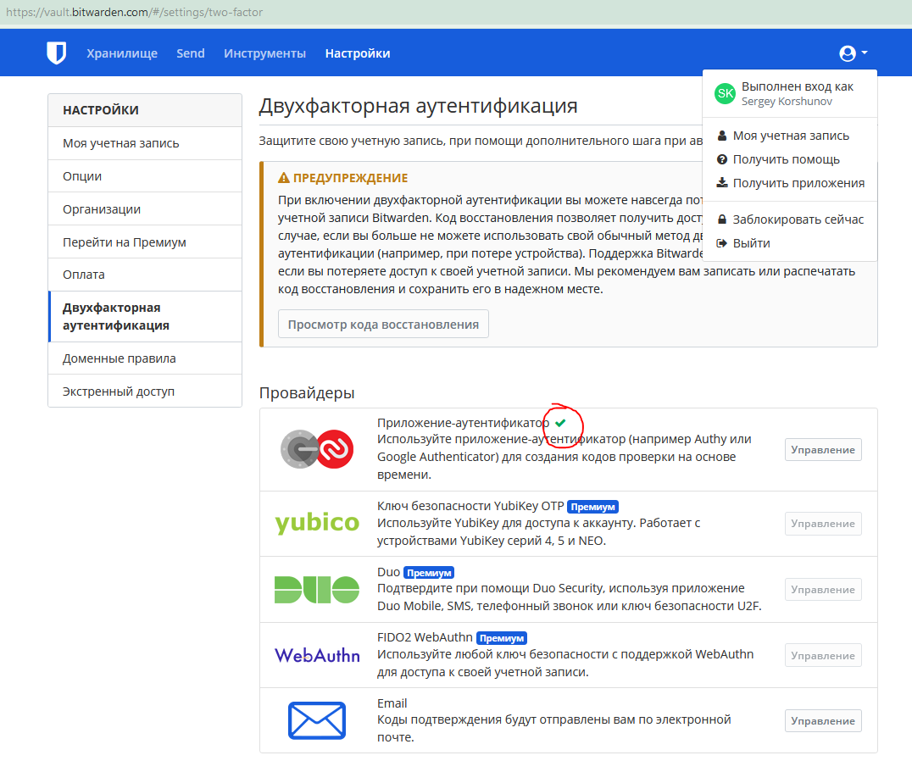
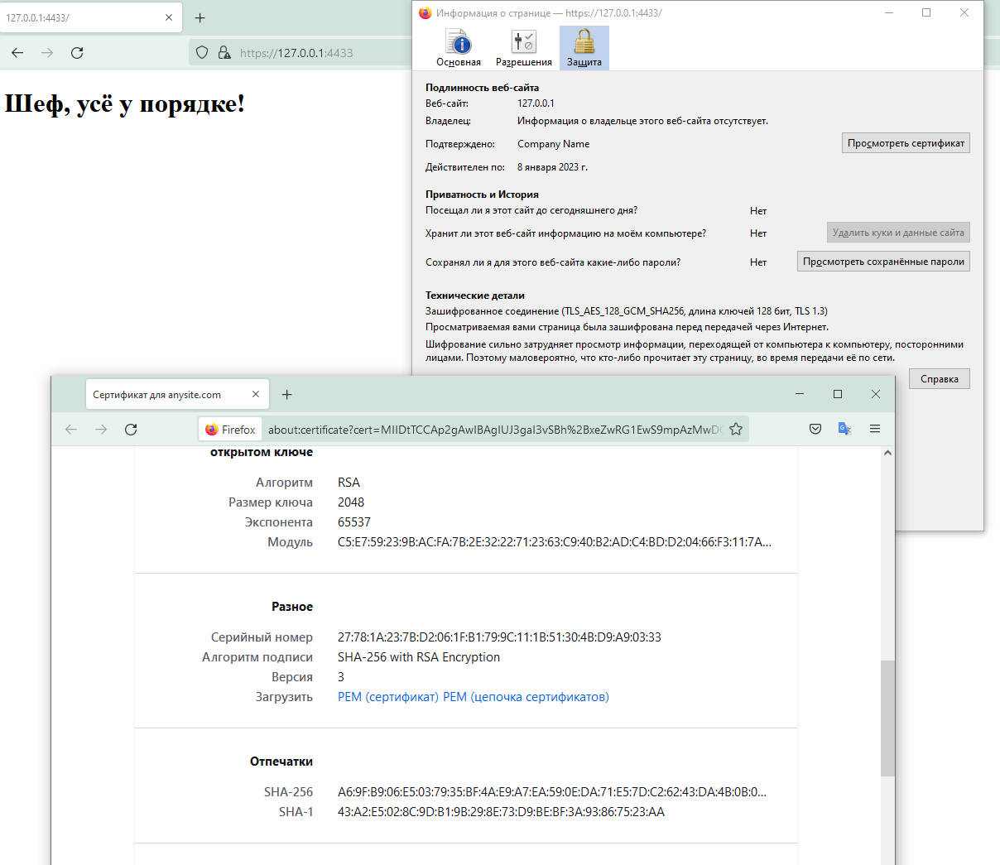
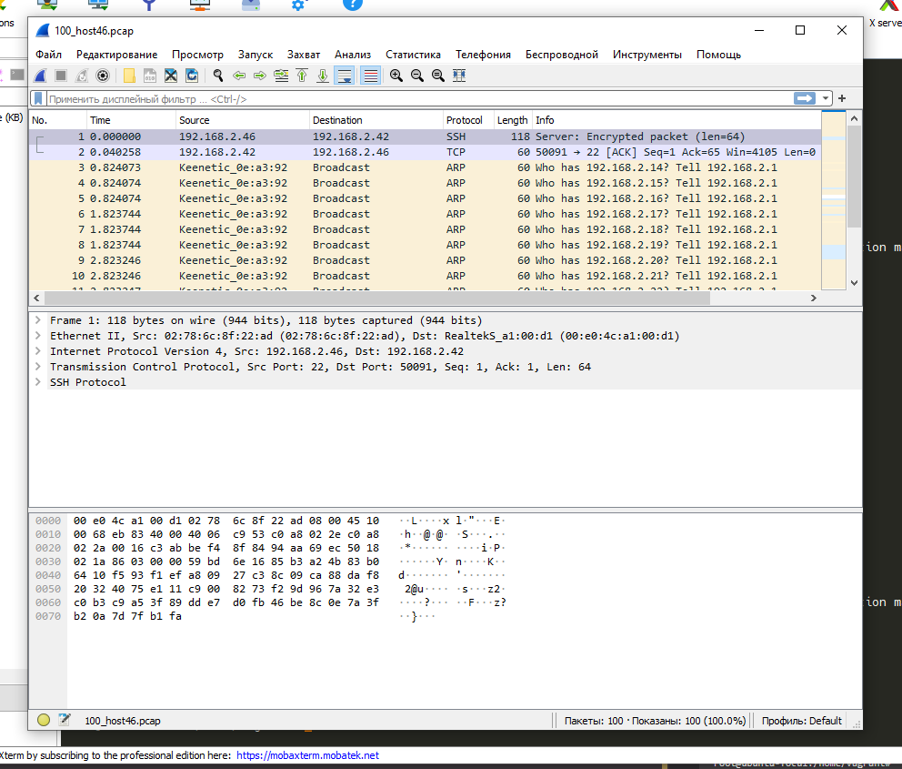

# devops-netology

### «3.9. Элементы безопасности информационных систем»

1. Установите Bitwarden плагин для браузера. Зарегестрируйтесь и сохраните несколько паролей.
---


---
---
2. Установите Google authenticator на мобильный телефон. Настройте вход в Bitwarden акаунт через Google authenticator OTP.
---


---
---
3. Установите apache2, сгенерируйте самоподписанный сертификат, настройте тестовый сайт для работы по HTTPS.
---
```shell
root@ubuntu-focal:/home/vagrant# sudo openssl req -x509 -nodes -days 365 -newkey rsa:2048 \
-keyout /etc/ssl/private/apache-selfsigned.key \
-out /etc/ssl/certs/apache-selfsigned.crt \
-subj "/C=RU/ST=Moscow/L=Moscow/O=Company Name/OU=Org/CN=anysite.com"
```

```shell
root@ubuntu-focal:/home/vagrant# cat /etc/apache2/sites-enabled/anysite.conf
<VirtualHost *:443>
   ServerName anysite.com
   DocumentRoot /var/www/anysite.com
   SSLEngine on
   SSLCertificateFile /etc/ssl/certs/apache-selfsigned.crt
   SSLCertificateKeyFile /etc/ssl/private/apache-selfsigned.key
</VirtualHost>
root@ubuntu-focal:/home/vagrant#
```

```shell
root@ubuntu-focal:/home/vagrant# cat /var/www/anysite.com/index.html
<!DOCTYPE html>
<html>
 <head>
  <meta charset="utf-8">
 </head>
 <body>
   <h1>Шеф, усё у порядке!</h1>
 </body>
</html>


root@ubuntu-focal:/home/vagrant#
```

```shell
root@ubuntu-focal:/home/vagrant# apache2ctl configtest
Syntax OK
root@ubuntu-focal:/home/vagrant# systemctl reload apache2
root@ubuntu-focal:/home/vagrant#
```


---
---
4. Проверьте на TLS уязвимости произвольный сайт в интернете (кроме сайтов МВД, ФСБ, МинОбр, НацБанк, РосКосмос, РосАтом, РосНАНО и любых госкомпаний, объектов КИИ, ВПК ... и тому подобное).
---
Проверил whoer.net. 

Есть пара потенциальных уязвимостей:
```shell
root@ubuntu-focal:/home/vagrant/testssl.sh# ./testssl.sh -U --sneaky https://whoer.net

###########################################################
    testssl.sh       3.1dev from https://testssl.sh/dev/
    (4a358e0 2022-01-06 21:17:40 -- )

      This program is free software. Distribution and
             modification under GPLv2 permitted.
      USAGE w/o ANY WARRANTY. USE IT AT YOUR OWN RISK!

       Please file bugs @ https://testssl.sh/bugs/

###########################################################

 Using "OpenSSL 1.0.2-chacha (1.0.2k-dev)" [~183 ciphers]
 on ubuntu-focal:./bin/openssl.Linux.x86_64
 (built: "Jan 18 17:12:17 2019", platform: "linux-x86_64")


Testing all IPv4 addresses (port 443): 104.26.2.223 104.26.3.223 172.67.70.188
--------------------------------------------------------------------------------
 Start 2022-01-08 19:32:55        -->> 104.26.2.223:443 (whoer.net) <<--

 Further IP addresses:   172.67.70.188 104.26.3.223
 rDNS (104.26.2.223):    --
 Service detected:       HTTP


 Testing vulnerabilities

 Heartbleed (CVE-2014-0160)                not vulnerable (OK), no heartbeat extension
 CCS (CVE-2014-0224)                       not vulnerable (OK)
 Ticketbleed (CVE-2016-9244), experiment.  not vulnerable (OK), no session tickets
 ROBOT                                     not vulnerable (OK)
 Secure Renegotiation (RFC 5746)           OpenSSL handshake didn't succeed
 Secure Client-Initiated Renegotiation     not vulnerable (OK)
 CRIME, TLS (CVE-2012-4929)                not vulnerable (OK)
 BREACH (CVE-2013-3587)                    potentially NOT ok, "br gzip" HTTP compression detected. - only supplied "/" tested
                                           Can be ignored for static pages or if no secrets in the page
 POODLE, SSL (CVE-2014-3566)               not vulnerable (OK)
 TLS_FALLBACK_SCSV (RFC 7507)              Downgrade attack prevention supported (OK)
 SWEET32 (CVE-2016-2183, CVE-2016-6329)    VULNERABLE, uses 64 bit block ciphers
 FREAK (CVE-2015-0204)                     not vulnerable (OK)
 DROWN (CVE-2016-0800, CVE-2016-0703)      not vulnerable on this host and port (OK)
                                           make sure you don't use this certificate elsewhere with SSLv2 enabled services
                                           https://censys.io/ipv4?q=C5487282362EBC916FEB6C0EE451B62E367ECB0B02D0D2E47D4F14F9A89DC19F could help you to find out
 LOGJAM (CVE-2015-4000), experimental      not vulnerable (OK): no DH EXPORT ciphers, no DH key detected with <= TLS 1.2
 BEAST (CVE-2011-3389)                     TLS1: ECDHE-RSA-AES128-SHA AES128-SHA ECDHE-RSA-AES256-SHA AES256-SHA
                                                 DES-CBC3-SHA
                                           VULNERABLE -- but also supports higher protocols  TLSv1.1 TLSv1.2 (likely mitigated)
 LUCKY13 (CVE-2013-0169), experimental     potentially VULNERABLE, uses cipher block chaining (CBC) ciphers with TLS. Check patches
 Winshock (CVE-2014-6321), experimental    not vulnerable (OK)
 RC4 (CVE-2013-2566, CVE-2015-2808)        no RC4 ciphers detected (OK)


 Done 2022-01-08 19:33:40 [  50s] -->> 104.26.2.223:443 (whoer.net) <<--

--------------------------------------------------------------------------------
 Start 2022-01-08 19:33:40        -->> 104.26.3.223:443 (whoer.net) <<--

 Further IP addresses:   172.67.70.188 104.26.2.223
 rDNS (104.26.3.223):    --
 Service detected:       HTTP


 Testing vulnerabilities

 Heartbleed (CVE-2014-0160)                not vulnerable (OK), no heartbeat extension
 CCS (CVE-2014-0224)                       not vulnerable (OK)
 Ticketbleed (CVE-2016-9244), experiment.  not vulnerable (OK), no session tickets
 ROBOT                                     not vulnerable (OK)
 Secure Renegotiation (RFC 5746)           OpenSSL handshake didn't succeed
 Secure Client-Initiated Renegotiation     not vulnerable (OK)
 CRIME, TLS (CVE-2012-4929)                not vulnerable (OK)
 BREACH (CVE-2013-3587)                    potentially NOT ok, "br gzip" HTTP compression detected. - only supplied "/" tested
                                           Can be ignored for static pages or if no secrets in the page
 POODLE, SSL (CVE-2014-3566)               not vulnerable (OK)
 TLS_FALLBACK_SCSV (RFC 7507)              Downgrade attack prevention supported (OK)
 SWEET32 (CVE-2016-2183, CVE-2016-6329)    VULNERABLE, uses 64 bit block ciphers
 FREAK (CVE-2015-0204)                     not vulnerable (OK)
 DROWN (CVE-2016-0800, CVE-2016-0703)      not vulnerable on this host and port (OK)
                                           make sure you don't use this certificate elsewhere with SSLv2 enabled services
                                           https://censys.io/ipv4?q=C5487282362EBC916FEB6C0EE451B62E367ECB0B02D0D2E47D4F14F9A89DC19F could help you to find out
 LOGJAM (CVE-2015-4000), experimental      not vulnerable (OK): no DH EXPORT ciphers, no DH key detected with <= TLS 1.2
 BEAST (CVE-2011-3389)                     TLS1: ECDHE-RSA-AES128-SHA AES128-SHA ECDHE-RSA-AES256-SHA AES256-SHA
                                                 DES-CBC3-SHA
                                           VULNERABLE -- but also supports higher protocols  TLSv1.1 TLSv1.2 (likely mitigated)
 LUCKY13 (CVE-2013-0169), experimental     potentially VULNERABLE, uses cipher block chaining (CBC) ciphers with TLS. Check patches
 Winshock (CVE-2014-6321), experimental    not vulnerable (OK)
 RC4 (CVE-2013-2566, CVE-2015-2808)        no RC4 ciphers detected (OK)


 Done 2022-01-08 19:34:26 [  96s] -->> 104.26.3.223:443 (whoer.net) <<--

--------------------------------------------------------------------------------
 Start 2022-01-08 19:34:26        -->> 172.67.70.188:443 (whoer.net) <<--

 Further IP addresses:   104.26.3.223 104.26.2.223
 rDNS (172.67.70.188):   --
 Service detected:       Couldn't determine what's running on port 443, assuming no HTTP service => skipping all HTTP checks


 Testing vulnerabilities

 Heartbleed (CVE-2014-0160)                not vulnerable (OK), no heartbeat extension
 CCS (CVE-2014-0224)                       not vulnerable (OK)
 Ticketbleed (CVE-2016-9244), experiment.  --   (applicable only for HTTPS)
 ROBOT                                     not vulnerable (OK)
 Secure Renegotiation (RFC 5746)           OpenSSL handshake didn't succeed
 Secure Client-Initiated Renegotiation     not vulnerable (OK)
 CRIME, TLS (CVE-2012-4929)                not vulnerable (OK) (not using HTTP anyway)
 POODLE, SSL (CVE-2014-3566)               not vulnerable (OK)
 TLS_FALLBACK_SCSV (RFC 7507)              Downgrade attack prevention supported (OK)
 SWEET32 (CVE-2016-2183, CVE-2016-6329)    VULNERABLE, uses 64 bit block ciphers
 FREAK (CVE-2015-0204)                     not vulnerable (OK)
 DROWN (CVE-2016-0800, CVE-2016-0703)      not vulnerable on this host and port (OK)
                                           make sure you don't use this certificate elsewhere with SSLv2 enabled services
                                           https://censys.io/ipv4?q=C5487282362EBC916FEB6C0EE451B62E367ECB0B02D0D2E47D4F14F9A89DC19F could help you to find out
 LOGJAM (CVE-2015-4000), experimental      not vulnerable (OK): no DH EXPORT ciphers, no DH key detected with <= TLS 1.2
 BEAST (CVE-2011-3389)                     TLS1: ECDHE-RSA-AES128-SHA AES128-SHA ECDHE-RSA-AES256-SHA AES256-SHA
                                                 DES-CBC3-SHA
                                           VULNERABLE -- but also supports higher protocols  TLSv1.1 TLSv1.2 (likely mitigated)
 LUCKY13 (CVE-2013-0169), experimental     potentially VULNERABLE, uses cipher block chaining (CBC) ciphers with TLS. Check patches
 Winshock (CVE-2014-6321), experimental    not vulnerable (OK)
 RC4 (CVE-2013-2566, CVE-2015-2808)        no RC4 ciphers detected (OK)


 Done 2022-01-08 19:35:12 [ 142s] -->> 172.67.70.188:443 (whoer.net) <<--

--------------------------------------------------------------------------------
Done testing now all IP addresses (on port 443): 104.26.2.223 104.26.3.223 172.67.70.188

root@ubuntu-focal:/home/vagrant/testssl.sh#
```

---
---
5. Установите на Ubuntu ssh сервер, сгенерируйте новый приватный ключ. Скопируйте свой публичный ключ на другой сервер. Подключитесь к серверу по SSH-ключу.
---
Склонировал сервер, настроил обе машины по бриджу. Один с адресом 192.168.2.46, другой с 192.168.2.56.

Работаю с 46-го:
```shell
vagrant@ubuntu-focal:~$ ssh-keygen
Generating public/private rsa key pair.
Enter file in which to save the key (/home/vagrant/.ssh/id_rsa):
Enter passphrase (empty for no passphrase):
Enter same passphrase again:
Your identification has been saved in /home/vagrant/.ssh/id_rsa
Your public key has been saved in /home/vagrant/.ssh/id_rsa.pub
The key fingerprint is:
SHA256:gWAX9VzaLVOImXYXGvO49yHJA6z9zNl4PcY8cFif+kA vagrant@ubuntu-focal
The key's randomart image is:
+---[RSA 3072]----+
|    o oo.  ++.o. |
|   . o . o*+oO.  |
|      . ..++*.o. |
|         .o o++ o|
|        S. ..E.+.|
|            =.%.o|
|             O Oo|
|              = o|
|               . |
+----[SHA256]-----+
vagrant@ubuntu-focal:~$ ssh-copy-id vagrant@192.168.2.56
/usr/bin/ssh-copy-id: INFO: Source of key(s) to be installed: "/home/vagrant/.ssh/id_rsa.pub"
The authenticity of host '192.168.2.56 (192.168.2.56)' can't be established.
ECDSA key fingerprint is SHA256:9y1Rt6nYRJ+ws5dKhjSrT3/uVHIqFyEeyOKDokzQ304.
Are you sure you want to continue connecting (yes/no/[fingerprint])? yes
/usr/bin/ssh-copy-id: INFO: attempting to log in with the new key(s), to filter out any that are already installed
/usr/bin/ssh-copy-id: INFO: 1 key(s) remain to be installed -- if you are prompted now it is to install the new keys
vagrant@192.168.2.56's password:

Number of key(s) added: 1

Now try logging into the machine, with:   "ssh 'vagrant@192.168.2.56'"
and check to make sure that only the key(s) you wanted were added.

vagrant@ubuntu-focal:~$
vagrant@ubuntu-focal:~$
vagrant@ubuntu-focal:~$ ssh vagrant@192.168.2.56
Welcome to Ubuntu 20.04.3 LTS (GNU/Linux 5.4.0-92-generic x86_64)

 * Documentation:  https://help.ubuntu.com
 * Management:     https://landscape.canonical.com
 * Support:        https://ubuntu.com/advantage

  System information as of Sun Jan  9 10:59:40 UTC 2022

  System load:  0.0               Processes:               146
  Usage of /:   4.7% of 38.71GB   Users logged in:         1
  Memory usage: 6%                IPv4 address for dummy0: 10.0.5.1
  Swap usage:   0%                IPv4 address for enp0s3: 192.168.2.56


1 update can be applied immediately.
To see these additional updates run: apt list --upgradable


Last login: Sun Jan  9 10:53:24 2022 from 192.168.2.46
vagrant@ubuntu-focal:~$
vagrant@ubuntu-focal:~$ ifconfig
dummy0: flags=195<UP,BROADCAST,RUNNING,NOARP>  mtu 1500
        inet 10.0.5.1  netmask 255.255.255.0  broadcast 10.0.5.255
        inet6 fe80::949e:3aff:fe44:8379  prefixlen 64  scopeid 0x20<link>
        ether 96:9e:3a:44:83:79  txqueuelen 1000  (Ethernet)
        RX packets 0  bytes 0 (0.0 B)
        RX errors 0  dropped 0  overruns 0  frame 0
        TX packets 43  bytes 8212 (8.2 KB)
        TX errors 0  dropped 0 overruns 0  carrier 0  collisions 0

enp0s3: flags=4163<UP,BROADCAST,RUNNING,MULTICAST>  mtu 1500
        inet 192.168.2.56  netmask 255.255.255.0  broadcast 192.168.2.255
        inet6 fe80::a00:27ff:fe12:eb44  prefixlen 64  scopeid 0x20<link>
        ether 08:00:27:12:eb:44  txqueuelen 1000  (Ethernet)
        RX packets 8802  bytes 1694627 (1.6 MB)
        RX errors 0  dropped 0  overruns 0  frame 0
        TX packets 1276  bytes 156163 (156.1 KB)
        TX errors 0  dropped 0 overruns 0  carrier 0  collisions 0

lo: flags=73<UP,LOOPBACK,RUNNING>  mtu 65536
        inet 127.0.0.1  netmask 255.0.0.0
        inet6 ::1  prefixlen 128  scopeid 0x10<host>
        loop  txqueuelen 1000  (Local Loopback)
        RX packets 144  bytes 7648 (7.6 KB)
        RX errors 0  dropped 0  overruns 0  frame 0
        TX packets 144  bytes 7648 (7.6 KB)
        TX errors 0  dropped 0 overruns 0  carrier 0  collisions 0

vagrant@ubuntu-focal:~$ exit
logout
Connection to 192.168.2.56 closed.
vagrant@ubuntu-focal:~$
```

---
---
6. Переименуйте файлы ключей из задания 5. Настройте файл конфигурации SSH клиента, так чтобы вход на удаленный сервер осуществлялся по имени сервера.
---
Done:
```shell
vagrant@ubuntu-focal:~$ mv .ssh/id_rsa .ssh/host56_rsa
vagrant@ubuntu-focal:~$ mv .ssh/id_rsa.pub .ssh/host56_rsa.pub
vagrant@ubuntu-focal:~$ vi .ssh/config
vagrant@ubuntu-focal:~$
vagrant@ubuntu-focal:~$ cat .ssh/config
Host host56
    Hostname 192.168.2.56
    IdentityFile /home/vagrant/.ssh/host56_rsa
vagrant@ubuntu-focal:~$
vagrant@ubuntu-focal:~$ ssh vagrant@host56
Welcome to Ubuntu 20.04.3 LTS (GNU/Linux 5.4.0-92-generic x86_64)

 * Documentation:  https://help.ubuntu.com
 * Management:     https://landscape.canonical.com
 * Support:        https://ubuntu.com/advantage

  System information as of Sun Jan  9 12:03:02 UTC 2022

  System load:  0.09              Processes:               147
  Usage of /:   4.7% of 38.71GB   Users logged in:         1
  Memory usage: 6%                IPv4 address for dummy0: 10.0.5.1
  Swap usage:   0%                IPv4 address for enp0s3: 192.168.2.56


1 update can be applied immediately.
To see these additional updates run: apt list --upgradable


Last login: Sun Jan  9 12:00:44 2022 from 192.168.2.46
vagrant@ubuntu-focal:~$ exit
logout
Connection to 192.168.2.56 closed.
vagrant@ubuntu-focal:~$
```

---
---
7. Соберите дамп трафика утилитой tcpdump в формате pcap, 100 пакетов. Откройте файл pcap в Wireshark.
---
```shell
root@ubuntu-focal:/home/vagrant# tcpdump -c 100 -w 100_host46.pcap -i enp0s3
tcpdump: listening on enp0s3, link-type EN10MB (Ethernet), capture size 262144 bytes
100 packets captured
147 packets received by filter
0 packets dropped by kernel
root@ubuntu-focal:/home/vagrant#
```
В итоге получил:


